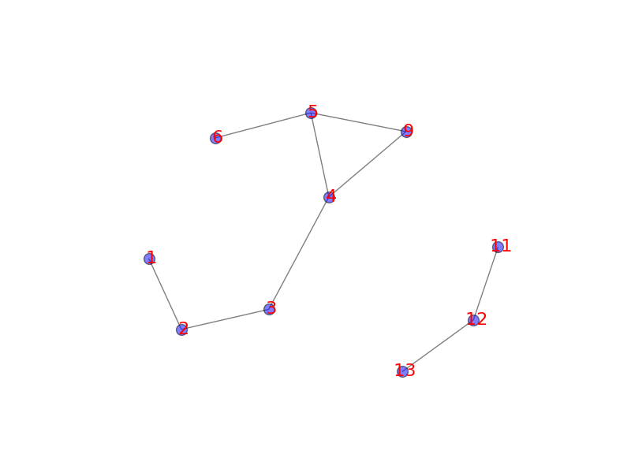

##Summary
This is a submission to the code challenge of Insight Data Engineering
originial repo: `https://github.com/InsightDataScience/digital-wallet`

##Requirements
Running the code requires installation of a Python package  Network.
To install the package use

`$ pip install networkx`

Or to get the git version located at

`https://github.com/networkx/networkx`

##Usage
An example of executing the code

`python ./src/antifraud.py ./paymo_input/batch_payment.txt ./paymo_input/stream_payment.txt ./paymo_output/output1.txt ./paymo_output/output2.txt ./paymo_output/output3.txt`

where the input `batch_payment.txt` is a list of past transactions (both trusted or unverified), `stream_payment` is a list of new transactions which may contain fraud transactions.
The outputs `output1.txt`, `output2.txt`, and `output3.txt` are results of fraud detection of each new transaction, with "trusted" mearning trusted transaction and "unverified" mearning potential fraud. Each output is associated with the fraud detection based on a feature specified in originial repo: `https://github.com/InsightDataScience/digital-wallet`.

##Implementation
To achieve maximum efficiency of fraud detection, I used the shortest path search in NetworkX. This method uses a bidirectional search algorithm.

##Results and Discussion
To have a sense of the structure of past transactions, I first generated a example drawing of network of users with transaction history based on the largest connected graph of the first 5000 transaction history.

One interesting feature of the network is that there are a few users that have frequent transactions with his neighbors. These users can be potential 'hubs' in determining the connectivity between two arbitrary users in the network.

Next we implement the search algorithm to determine the degree of connectivitiy between users who have new transactions.
To verify the search algorithm is correctly implemented, I devised a network with the following graphical representation.

which has some essential features such as 'unconnected' users, users with 1-4 degree of connectivity, and connectivity with different paths. The tests are passed and recorded in the subfolder `insight_testsuite/tests/test-2-paymo-trans/`.

##Possible new implementations
In the future, fraud detection can be based on more features, such as time of transaction or messages. Some new possible implementations include:
* find similarity between users based on natural language processing (NLP) of users' messages.
* find time-series analysis to detect user's transaction during unusual time
* issue warning when transaction is of large amount