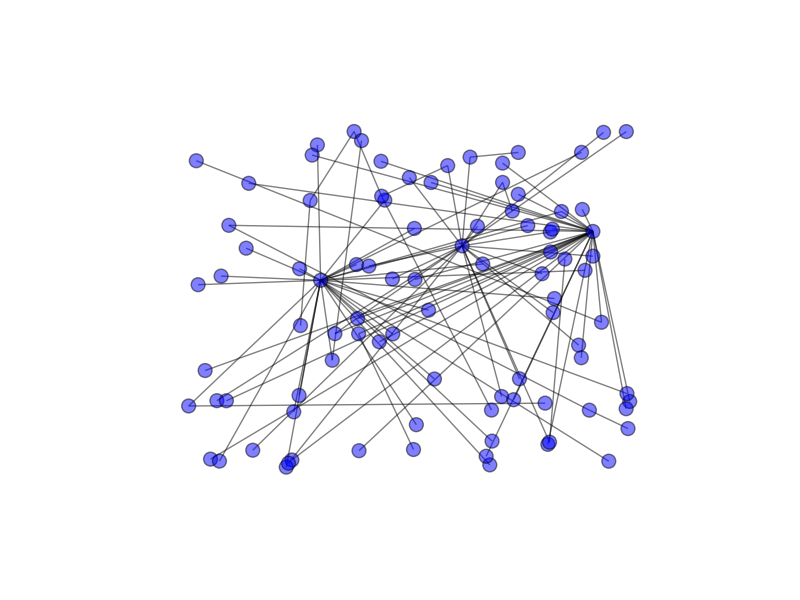

# Table of Contents

1. [Summary] (README.md#implementation)
2. [Requirements] (README.md#requirements)
3. [Usage] (README.md##usage)
4. [Implementation] (README.md#implementation)
5. [Results] (README.md#results)

##Summary
This is a submission to the code challenge of Insight Data Engineering
originial repo: `https://github.com/InsightDataScience/digital-wallet`

##Requirements
Running the code requires installation of a Python package  Network.
To install the package use
`$ pip install networkx`
Or to get the git version located at
`https://github.com/networkx/networkx`

##Usage
An example of executing the code
`python ./src/antifraud.py ./paymo_input/batch_payment.txt ./paymo_input/stream_payment.txt ./paymo_output/output1.txt ./paymo_output/output2.txt ./paymo_output/output3.txt`
where the input `batch_payment.txt` is a list of past transactions (both trusted or unverified), `stream_payment` is a list of new transactions which may contain fraud transactions.
The outputs `output1.txt`, `output2.txt`, and `output3.txt` are results of fraud detection of each new transaction, with "trusted" mearning trusted transaction and "unverified" mearning potential fraud. Each output is associated with the fraud detection based on a feature specified in originial repo: `https://github.com/InsightDataScience/digital-wallet`.

##Implementation
To achieve maximum efficiency of fraud detection, I used the shortest path search in NetworkX. This method uses a bidirectional search algorithm.

##Results
To have a sense of the structure of past transactions, I first generated a example drawing of network of users with transaction history based on the largest connected graph of the first 5000 transaction history.

##Discussion